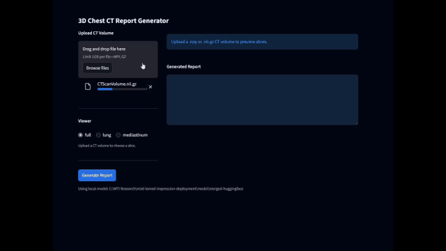

# CT Impression AI

CT Impression AI is a deployment package for a 3D CT impression-generation system. It wraps a fine-tuned M3D-LaMed Phi-3 model and supporting research components so the project can be reviewed, demonstrated, and deployed from a clean GitHub repository.

The project includes a Netlify-ready static homepage, a serverless metadata endpoint, evaluation outputs, training code, and local Streamlit apps for running inference against the packaged model artifacts.

## Demo Video



## What Is Included

- `public/` contains the static homepage and deployment demo video.
- `netlify/functions/` contains the model metadata and evaluation endpoint.
- `model/merged-huggingface/` contains the Hugging Face-style model configuration and supporting artifacts.
- `model/clip-alignment/` contains the final CLIP alignment checkpoints.
- `model/moco-resnet50/` contains the final MoCo ResNet50 checkpoints.
- `evaluation/` contains model evaluation summaries and per-sample outputs.
- `training/` contains training configuration and supporting training scripts.
- `streamlit_app.py` and `ct_chat_streamlit_app.py` provide local inference UIs.

## External Model Weights

GitHub LFS rejects individual files larger than 2 GB. The final merged LLM weight is therefore intentionally excluded from the repository:

```text
model/merged-huggingface/model.safetensors
```

Local file size: `2,669,529,114` bytes.

The model weights are stored in Google Drive:

- [CT Impression AI Weights](https://drive.google.com/drive/folders/1OHFWWImzKr2ieTvVauLILBg2zl0s2pfO)

Uploaded folder on the development machine:

```text
H:\My Drive\CT Impression AI Weights
```

The Drive folder contains:

- `model.safetensors`
- `vision_encoder_ft.pt`
- `projector.pt`
- `tokenizer.model`
- `clip_alignment_best_model.pt`
- `clip_alignment_final_model.pt`
- `moco_resnet50_best_checkpoint.pth`
- `moco_resnet50_final_checkpoint.pth`

To restore full local inference after cloning the repository, download the file and place it at:

```text
model/merged-huggingface/model.safetensors
```

The remaining large files are tracked with Git LFS.

## Use The Static Demo

Install dependencies and verify the package:

```bash
npm install
npm run verify
```

Run the Netlify development server:

```bash
npm run dev
```

The homepage displays the deployment demo video from:

```text
public/deployment-demo.mp4
```

## Use The Local Inference App

Install Python dependencies:

```bash
pip install -r requirements.txt
```

Make sure the external `model.safetensors` file has been restored to `model/merged-huggingface/`, then run:

```bash
streamlit run streamlit_app.py
```

For the CT-CHAT-style interface, run:

```bash
streamlit run ct_chat_streamlit_app.py --server.port 8502
```

Detailed Streamlit notes are available in `STREAMLIT_DEPLOYMENT_README.md` and `CT_CHAT_DEPLOYMENT_README.md`.

## Deployment Notes

Netlify is suitable for the static homepage and lightweight metadata endpoint. Full model inference should run on a GPU-backed service such as Hugging Face Inference Endpoints, RunPod, Modal, AWS SageMaker, or a private GPU server.

Recommended deployment pattern:

1. Host the excluded `model.safetensors` file and inference runtime on a GPU service.
2. Deploy the `public/` site to Netlify.
3. Point the frontend or serverless endpoint to the external inference API.

For a no-cost deployment path, see `FREE_DEPLOYMENT.md`.

## Source Model

Base model:

```text
GoodBaiBai88/M3D-LaMed-Phi-3-4B
```

Original local source folder:

```text
C:\MTI Research\M3D-LaMed\lamed_phi3_resnet50_impression
```
